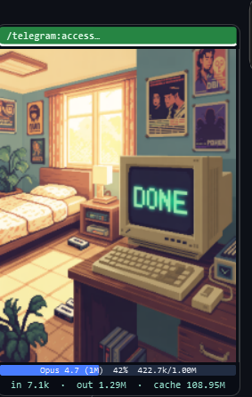

# CC-Beeper-Win

A Windows companion widget for [Claude Code](https://docs.claude.com/en/docs/claude-code).
Inspired by the macOS-only [vecartier/cc-beeper](https://github.com/vecartier/cc-beeper) —
this is a from-scratch Windows port with per-session tabs, an approval
ladder, context + token meters, and a small pixel-art pet bedroom.

> Built in one long Claude Code session as a worked example of using CC to
> design and iterate on a real desktop tool — hooks, process-tree tricks,
> an async approval queue, transcript parsing, and a PySide6 UI, all
> shaped through back-and-forth with the model. Feel free to fork,
> hack, or rebuild for your own setup.

<p align="center">
  
</p>

<p align="center"><i>Widget floating on the desktop (bottom-right corner). Click the image to view full size.</i></p>

## What it does

A resizable frosted-glass HUD pinned on top of everything, one row per
Claude Code session. Every surface is state-coded so a glance tells you
what's waiting on you.

### Multi-session tab strip

Browser-style tabs across the top of the glass. Each tab has a
coloured stripe on its top edge matching the session state (grey = idle,
green = done, amber = working, blue = input needed, orange = approval
pending, dark red = error). The active tab lifts 2 px and bolds. New
sessions appear automatically; closed terminals drop their tab within
~8 seconds. Three ways to switch: click a tab, use the **◀ / ▶** arrows,
or click the **☰** playlist button on the far left for a dropdown
listing every session. Right-click any tab to **rename** it — the
custom name persists for the life of the session.

### Worded state badge + letter-coded action circle

A pill-shaped badge top-right spells the state (`IDLE`, `WORKING`,
`DONE`, `INPUT`, `APPROVE`, `ERROR`) in the matching colour. A big
circular button bottom-centre shows a single-letter code — **I / D / W /
IN / A / E** — with distinctive per-state animation:

- `W` amber with a rotating clock-sweep arc — Claude is working
- `D` green, steady — turn finished
- `IN` blue, soft flash — Claude asked a follow-up
- `A` red with a pulsing red halo ring — tool permission pending
- `E` dark crimson, fast flash — last turn failed
- `I` white, steady — idle

Click the circle to approve when pending, otherwise it focuses the
session's terminal.

### 4-way approval ladder

When Claude wants permission for a tool, a popup offers *Allow once* /
*Allow for this session* / *Allow forever (this category)* / *Deny*.
"Forever" survives restarts via `trust.json`. A **Manage trust…** dialog
(right-click the widget) lets you view and revoke any approval.

### Context + token meter

Reads the session transcript directly: auto-detects the model, shows
current context usage as a progress bar (green / orange / red), and a
live line of lifetime input / output / cache-read totals.

### Slash-command dropdown + export

A **⇣ Commands ▾** button on the bottom-right fires `/compact`,
`/clear`, `/cost`, `/model`, or `/resume` at the active session's
terminal. At the bottom of that menu: **📄 Export Session Stats To Txt**
writes a plain-text report covering identity, model, token totals,
derived economics (cache-hit rate, output/input ratio), insights
generated from the actual numbers, and tailored token-hygiene tips.

### Click-to-focus terminal

Clicking the sprite or the circle brings the exact terminal tab hosting
the active Claude session back to the foreground. HWND is resolved at
hook time via the process tree *and* a window-title fallback, so it
works even when Windows Terminal re-parents its shells to explorer.

### Melodic sound cues

Three short bell-synth chimes, generated on first run and saved to
`assets/sounds/`:

- **Approve** — E5 → C5 descending ding-dong on pending tool approval
- **Input** — A4 → C♯5 → E5 rising arpeggio when Claude asks a follow-up
- **Done** — C5 → E5 → G5 rising major triad on turn completion

Each cue fires only on state transition (not on every poll), throttled
per-session. Right-click → **Sound Cues** to toggle.

### Glass aesthetic, fully tunable

Translucent warm-white panel with rounded corners, subtle top-edge
highlight, soft drop shadow. Right-click anywhere on the widget for the
full menu: Strategy / Mode / **Opacity** (60-100 % presets + custom
slider) / Sound Cues / Help / Manage Trust / Quit. **Drag any edge or
corner** to resize; size persists across restarts.

### Strategy × Mode

Right-click menu shows the live selection. Three **strategies**
(`assist` = widget is the permission UI — default; `observer` = never
override Claude; `auto` = headless rules + optional Gemini) and four
**modes** setting how lenient auto-allow is (`strict` / `relaxed` /
`trusted` / `yolo`).

### Safety net

Catastrophic Bash commands (`rm -rf /`, `git push --force`,
`drop table`, `mkfs`…) are always hard-denied at the hook, even in
YOLO mode.

### Optional Gemini Flash classifier

Set `GEMINI_API_KEY` in `.env` and flip `security.gemini_enabled` in
`config.json`: risky auto-allowed tool calls get a ~300 ms "does this
serve the stated task?" sanity check and are downgraded to a prompt
if they don't.

## Requirements

- Windows 10/11
- Python 3.10+
- Claude Code CLI installed (`claude` on PATH)
- Git Bash (comes with Git for Windows) — used to execute the hook
  commands that Claude Code stores in `~/.claude/settings.json`

## Install

```bash
git clone https://github.com/<you>/cc-beeper-win.git
cd cc-beeper-win
pip install -r requirements.txt
python installer/install_hooks.py
```

The installer writes HTTP-hook entries into `~/.claude/settings.json`
alongside any existing hooks. Every entry is tagged with `cc-beeper-win`
in the command string so it can be cleanly uninstalled later. Your
`settings.json` is backed up to `settings.json.ccbeeper.bak` first.

## Run

```bash
start_all.bat          # launches the hook server + widget in the background
```

or manually:

```bash
pythonw server/server.py    # local HTTP server on 127.0.0.1:19222-19230
pythonw widget.py           # the tabbed widget
```

Verify the server is alive:

```bash
curl http://127.0.0.1:19222/health
# {"ok":true, "mode":"relaxed", ...}
```

Open a new Claude Code session (`claude` in a terminal). A new tab will
appear on the widget as soon as your first prompt fires. Reject or
approve its permission prompts with the widget's four buttons.

### If the widget closes

The hook server keeps running in the background even if the widget
window closes, so your Claude sessions keep working. To bring the
widget back:

```bash
start_widget.bat   # relaunches just the widget (server keeps running)
```

Or `start_all.bat` to restart both. Widget crashes are logged to
`widget.log` — check there first if it won't stay open.

### Desktop / Start Menu / taskbar shortcut (recommended)

```bash
install_launcher.bat   # creates Desktop + Start Menu shortcuts with a proper icon
```

This places a **CC-Beeper-Win** shortcut on your Desktop and in the
Start Menu. Right-click either one → **Pin to taskbar** for a
one-click relaunch from your taskbar. Clicking the shortcut runs
`launcher.pyw` which is idempotent: it starts the server and widget
if they aren't already running, and does nothing if they are. Safe
to click as many times as you want.

### Auto-launch on login (optional)

```bash
install_autostart.bat   # creates a shortcut in shell:startup
```

The widget + server will launch whenever you sign in. To undo, delete
the `CC-Beeper-Win.lnk` shortcut from `shell:startup`.

## Uninstall

```bash
python installer/uninstall_hooks.py   # remove just the cc-beeper-win entries
# or
python installer/install_hooks.py --uninstall
```

Your other settings.json hooks are untouched.

## Configuration

Everything lives in `config.json` at the project root. Defaults are
safe. Relevant knobs (valid JSON, comments here are for docs only):

```json
{
  "decision_strategy": "assist",
  "mode": "relaxed",
  "security": {
    "gemini_enabled": false,
    "gemini_timeout_s": 4.0,
    "safety_net_block_catastrophic": true
  },
  "widget": {
    "width": 400,
    "height": 210,
    "corner": "bottom-right",
    "margin": 16,
    "opacity_pct": 95,
    "sound_enabled": true
  }
}
```

- `decision_strategy` — `assist` / `observer` / `auto`
- `mode` — `strict` / `relaxed` / `trusted` / `yolo`
- `widget.opacity_pct` — 20–100 (also settable via right-click → Opacity)
- `widget.sound_enabled` — mute/unmute the chimes
- Anything you change via the right-click menu is written back here

Your approved "allow forever" categories live in `trust.json` (repo
ships empty). Session-scoped approvals stay in RAM only. Delete
`trust.json` to wipe persistent trust.

### Custom sprite pack

Drop your own 64 × 64 PNGs into `assets/custom/` using the same
filenames as the bundled ones — the widget picks them up on next
launch, falling back to the bundled sprite for anything you
haven't overridden. Filenames to match:

```
assets/custom/snoozing.png   # idle
assets/custom/working.png    # mid-turn
assets/custom/done.png       # turn complete
assets/custom/input.png      # follow-up question
assets/custom/allow.png      # approval pending
assets/custom/error.png      # last turn failed
assets/custom/listening.png  # voice / listening state
```

The folder is gitignored — your custom pack stays local.

## Architecture

```
claude  ──hook fires──>  bash curl  ──POST──>  FastAPI server  ──poll──>  widget
                                                     │                    (every 500 ms)
                                                     └── optional: Gemini classifier
```

- `server/server.py` — hook endpoints (`/sessionstart`, `/pretooluse`,
  `/stop`, `/sessionend`, …), per-session state, pending-request queue
  (`asyncio.Event` gate), terminal HWND resolution (process-tree walk +
  title-match fallback), liveness sweep based on `claude.exe` PID.
- `server/classify.py` — tool-call → category (`Bash:git-read`,
  `Write:config`, `MCP:write:…`).
- `server/security.py` — regex fast-path (prompt-injection patterns,
  credential-path regexes, irreversible-command regexes) + optional
  Gemini Flash classifier for "does this serve the stated task?".
- `server/stats.py` — transcript JSONL parser; model auto-detect,
  context/token math, first-user-prompt extraction for tab labels.
  200 MB file-size guard against pathological transcripts.
- `server/trust.py` — session + persistent trust store, 4 mode matrices.
- `widget.py` — PySide6 widget: glass panel, tab strip, playlist menu,
  context meter, pill state badge, custom-painted action circle with
  per-state animations, approval popup, rename / export dialogs,
  edge-resize, sound synthesis, tray menu, help dialog.
- `installer/install_hooks.py` — reversibly injects hook entries into
  `~/.claude/settings.json`, tagged with `cc-beeper-win` for clean
  removal. Handles Git Bash cygwin-PID → Win32-PID bridging via
  `/proc/$$/winpid` so `psutil` can walk the process tree.
- `launcher.pyw` — idempotent server-and-widget launcher used by the
  Desktop / Start Menu shortcuts.

## Security notes

- The hook server binds to `127.0.0.1` only — no external network
  exposure. There is no auth on the local API, which is the standard
  localhost threat model: any process already on your machine could POST
  to `/resolve` and auto-approve a pending request. Don't run this on a
  shared machine or a hostile environment.
- The optional Gemini Flash classifier is **off by default**. When you
  enable it (`security.gemini_enabled: true` + `GEMINI_API_KEY` in `.env`),
  each risky tool call's `tool_input` + your session's latest user prompt
  are POSTed to Google's Gemini API. Leave it off if you work on sensitive
  code.
- The safety net hard-denies obviously catastrophic Bash commands
  (`rm -rf /`, `git push --force`, `drop table`, `mkfs`) even in YOLO mode.
  Toggle with `security.safety_net_block_catastrophic`.
- The installer backs up `~/.claude/settings.json` to
  `settings.json.ccbeeper.bak` before modifying it, and all injected hook
  entries are tagged with `cc-beeper-win` for clean reversal. Your other
  hooks are never touched.

## Full feature list + roadmap

See [FEATURES.md](FEATURES.md) for a complete inventory of what's
shipped and a ranked backlog of potential improvements.

## License

MIT — see [LICENSE](LICENSE).

## Acknowledgements

- Original concept: [vecartier/cc-beeper](https://github.com/vecartier/cc-beeper) (macOS, Swift 6).
- Pixel-art sprites were generated with Gamma + ideogram-v3-turbo.
- Built interactively via Claude Code.
